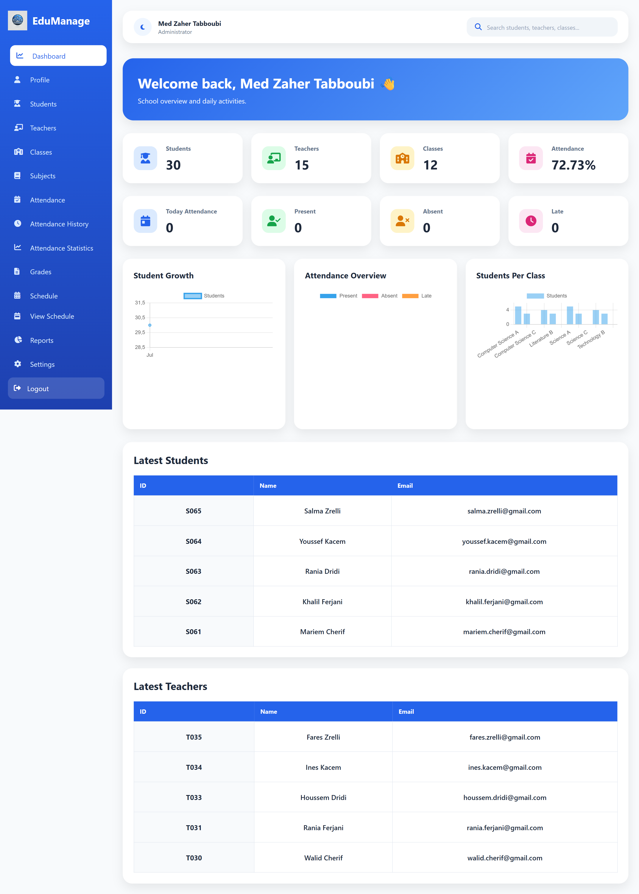
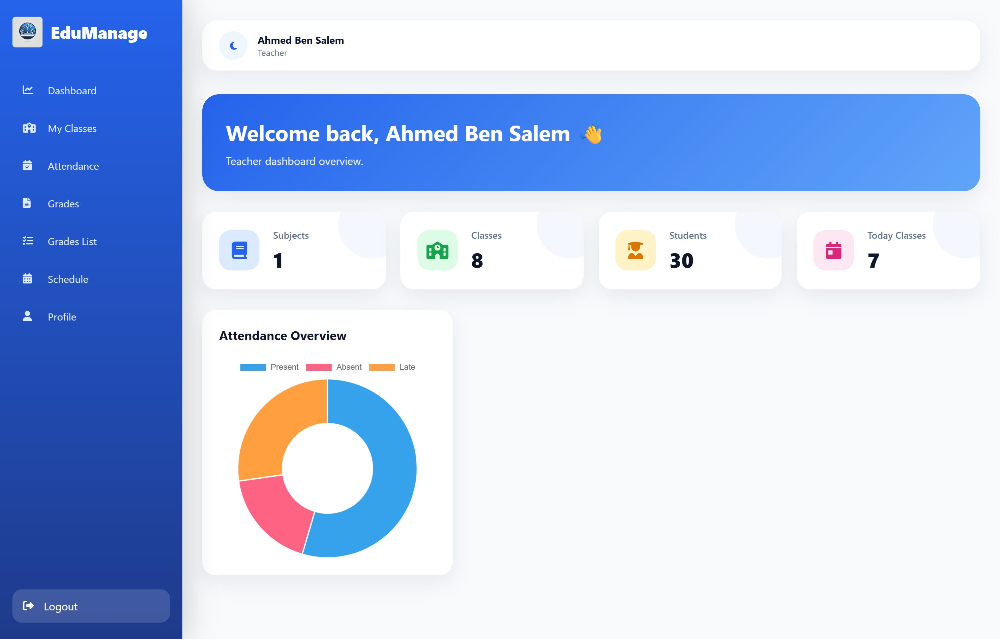
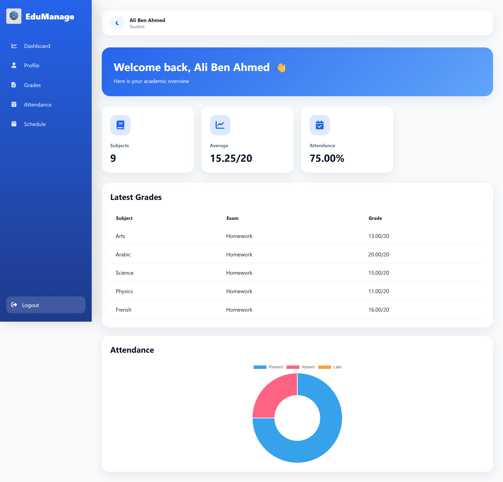

# EduManage

EduManage is a web-based school management system built to help schools manage their daily operations through a simple and organized platform.

The system provides different interfaces for administrators, teachers, and students with role-based access control.

---

# Features

## Admin Dashboard

Administrators can:

- Manage students
- Manage teachers
- Manage classes
- Manage subjects
- Assign teachers to subjects
- Create and manage schedules
- Manage attendance
- Manage student grades
- View school statistics and dashboard overview
- Manage user accounts

---

## Teacher Dashboard

Teachers can:

- View their personal schedule
- View assigned classes
- Add student grades
- View grades they have added
- Manage attendance for their classes

---

## Student Dashboard

Students can:

- View their personal schedule
- View their grades
- View their personal information
- Access their academic information

---

# Technologies Used

- PHP
- MySQL
- HTML5
- CSS3
- JavaScript
- Font Awesome
- XAMPP

---

# Project Structure

```
EduManage
│
├── assets
│   ├── css
│   ├── js
│   └── images
│
├── config
│   └── database_example.php
│
├── includes
│   ├── authentication
│   ├── headers
│   └── sidebars
│
├── users
│   ├── admin
│   ├── teacher
│   └── student
│
└── index.php
```

---

# Installation

## 1. Clone the repository

```
git clone https://github.com/zahertabboubi/EduManage.git
```

## 2. Setup the database

- Create a MySQL database
- Import the provided SQL database file
- Configure your database connection

Create:

```
config/database.php
```

Example:

```php
<?php

$conn = new PDO(
    "mysql:host=YOUR_HOST;dbname=YOUR_DATABASE;charset=utf8",
    "YOUR_USERNAME",
    "YOUR_PASSWORD"
);

?>
```

## 3. Run the project

Using XAMPP:

- Place the project inside the `htdocs` folder
- Start Apache and MySQL
- Open:

```
http://localhost/EduManage
```

---

# Admin Registration

To create an administrator account during setup, use the registration code:

```
0000
```

This code allows administrator account creation for the demo version.

---

# Live Demo

GitHub Pages:

https://zahertabboubi.github.io/EduManage/

InfinityFree Website:

https://edumanage.site.je

---

# Screenshots

## Login Page


## Admin Dashboard



## Teacher Dashboard



## Student Dashboard



# Security

- Database credentials are not included in this repository.
- Sensitive configuration files are protected using `.gitignore`.
- Authentication system with role-based access control is implemented.
- Different permissions are applied for administrators, teachers, and students.

---

# Future Improvements

Planned improvements:

- More advanced reports
- Email notifications
- Better analytics
- Mobile optimization
- More customization options

---

# License

This project is licensed under the MIT License.

You are free to use, modify, and distribute this project according to the license terms.

---

# Author

Created by Zaher Tabboubi
